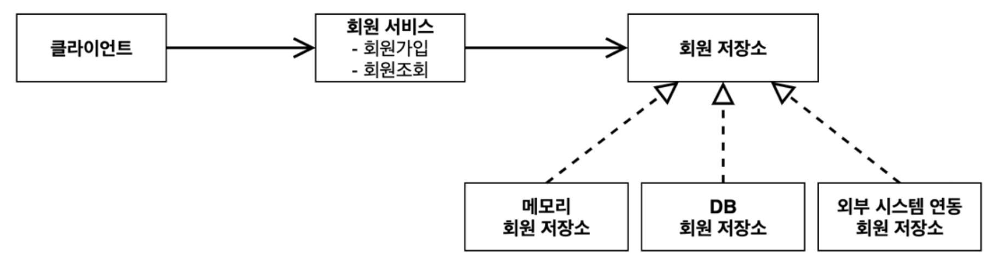
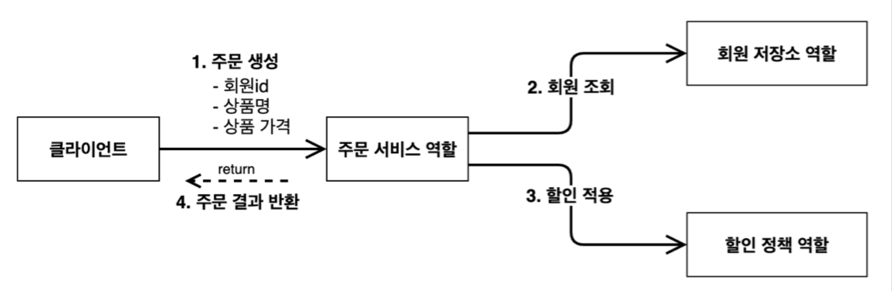

> [인프런 김영한님 -스프링 핵심 원리 - 기본편](https://www.inflearn.com/course/%EC%8A%A4%ED%94%84%EB%A7%81-%ED%95%B5%EC%8B%AC-%EC%9B%90%EB%A6%AC-%EA%B8%B0%EB%B3%B8%ED%8E%B8)

# 2. 스프링 핵심 원리 이해1 -예제

### 2-1 프로젝트 생성

+ 환경 : Java11 , IntelliJ

+ [스프링 부트 스타터 사이트](https://start.spring.io)로 이동해서 스프링 프로젝트 생성

+ 프로젝트 선택
  
  + Project: Gradle - Groovy Project
    Spring Boot: 2.3.x  
    Language: Java  
    Packaging: Jar
    
    Java: 11
    Project Metadata
    
    groupId: hello
    
    artifactId: core
    Dependencies: 선택하지 않는다.

+ build.gradle -> open as project (IntelliJ)

+ preferences-> gradle 검색 -> Build and run using , Run tests using -> IntelliJ Idea 
  
  Gradle 대신에 Intelli J 가 자바를 직접실행하게 하여 실행속도를 빠르게 .

## 2-2  비즈니스 요구사항과 설계 (순수한 자바로만)

+ 회원 도메인 설계
  
  + 회원 도메인 요구사항  
    -회원을 가입하고 조회할 수 있다.  
    -회원은 일반과 VIP 두 가지 등급이 있다.  
    -회원 데이터는 자체 DB를 구축할 수 있고, 외부 시스템과 연동할 수 있다. (미확정)
  + 
  + 분석
    + 회원저장소를 아직 어떤 것을 사용할지 미정이기 때문에 인터페이스를 통한 구현은 필수적이다.

+ 설계
  
  + <u>회원은 일반과 VIP 두 가지 등급이 있다.</u>  
    
    ```java
    package hello.core.member;
    
    public enum Grade {
        BASIC,
        VIP
    }
    ```
    
    (enum은 열거형(enumerated type)이라고 부른다. 열거형은 서로 연관된 상수들의 집합이라고 할 수 있다)  ->** enum 공부 필요!**
  
  + 
  
  ​
  
  ​
  
  ​
  
  ​
  
  ​
  
  ​
  
  ​
  
  ​
  
  ​
  
  ​

+ 주문 도메인 설계

+ 
