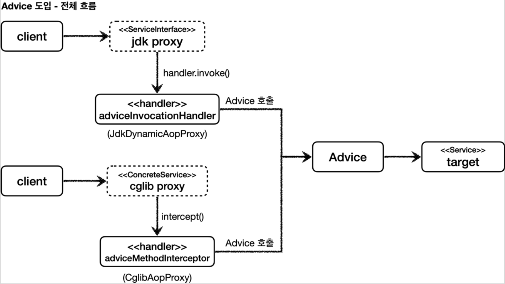
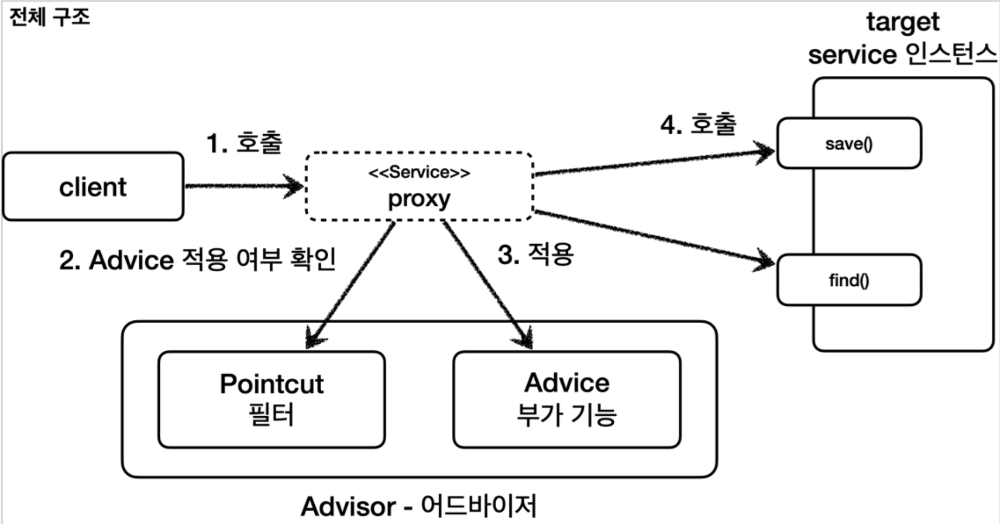

[인프런 김영한님 강의 - 스프링_고급](https://www.inflearn.com/course/%EC%8A%A4%ED%94%84%EB%A7%81-%ED%95%B5%EC%8B%AC-%EC%9B%90%EB%A6%AC-%EA%B3%A0%EA%B8%89%ED%8E%B8/dashboard)

# 

# 06 스프링이 지원하는 프록시

#### 앞선 장에서

동적 프록시를 가능케하는 두가지 기술을 살펴 보았다. 

1. JDK 동적 프록시 기술

2. CGLIB 기술

만약 이 두 기술에 상황에 맞게 알아서 써주는 기능을 제공해줬으면 한다. 스프링이 편리하게 추상화된 기술을 제공한다. 

바로 `ProxyFactory` 가 그것이다.

프록시 팩토리는 인터페이스가 있으면 JDK 동적 프록시 기술을 사용하고, 그렇지 않으면 CGLIB 기술을 사용한다.

#### 그렇다면

JDK 동적프록시와 CGLIB 기술에서 요구하는 구현체는 각각 달랐다. 그럼 이 두가지를 모두 구현 해야한는가? 

그렇지 않다. 스프링은 이 두개를 통합한 `Advice` 라는 개념을 도입했다. 

#### Advice 흐름



+ 프록시 팩토리를 사용하면 `InvocationHandler` 와 `MethodInterCeptor` 를 내부적으로 사용하긴 하는데 이 둘 모두 Advice를 호출하게 되므로 최종적으로 우리가 `Advice` 내부에서 정의한 추가로직이 수행될것이다.

<br>

## 06-1 Advice 구현

#### 예제

```java
@Slf4j
public class TimeAdvice implements MethodInterceptor {

    @Override
    public Object invoke(MethodInvocation invocation) throws Throwable {
        log.info("TimeProxy 실행");
        long startTime = System.currentTimeMillis();

        //Object result = methodProxy.invoke(target, args);
        Object result = invocation.proceed();

        long endTime = System.currentTimeMillis();

        long resultTime = endTime - startTime;
        log.info("TimeProxy 종료 resultTime = {}ms", resultTime);

        return result;
    }
}
```

+ CGLIB기술의 `MethodInterceptor` 랑 이름은 같은데 다른놈이다. 이친구는 상속을 따라가면 `Advice` 인터페이스가 나온다.

+ 파라미터로 넘어오는 `MethodInvocation` 에 `target` 에 대한 정보가 모두 담겨있다. 프록시 생성하는 과정에서 다 전달 받는다.

#### 인터페이스가 있을경우

```java
    @Test
    @DisplayName("인터페이스가 있으면 JDK 동적 프록시 사용")
    void interfaceProxy() {
        ServiceInterface target = new ServiceImpl();
        ProxyFactory proxyFactory = new ProxyFactory(target);

        proxyFactory.addAdvice(new TimeAdvice());
        ServiceInterface proxy = (ServiceInterface) proxyFactory.getProxy();

        log.info("targetClass={}", target.getClass());
        log.info("proxyClass={}", proxy.getClass());

        proxy.save();
        assertThat(AopUtils.isAopProxy(proxy)).isTrue();
        assertThat(AopUtils.isJdkDynamicProxy(proxy)).isTrue(); //ProxyFactory로 생성한 것만 적용됨
        assertThat(AopUtils.isCglibProxy(proxy)).isFalse();

    }
```

+ 이때 당연히 생성된 프록시는 JdkDynamicProxy 객체이다.

#### 인터페이스가 없을 경우

```java
    @Test
    @DisplayName("구체 클래스만 있으면 CGLIB 실행")
    void concreteProxy() {
        ConcreteService target = new ConcreteService();
        ProxyFactory proxyFactory = new ProxyFactory(target);

        proxyFactory.addAdvice(new TimeAdvice());
        ConcreteService proxy = (ConcreteService) proxyFactory.getProxy();

        log.info("targetClass={}", target.getClass());
        log.info("proxyClass={}", proxy.getClass());

        proxy.call();
        assertThat(AopUtils.isAopProxy(proxy)).isTrue();
        assertThat(AopUtils.isJdkDynamicProxy(proxy)).isFalse(); //ProxyFactory로 생성한 것만 적용됨
        assertThat(AopUtils.isCglibProxy(proxy)).isTrue();

    }
```

+ 이때는 당연히 CGLIB 프록시 객체가 생성된다.

<u>타겟의 인터페이스 사용유무로 확인하는 것이다.</u>

#### proxyTargetClass = True

```java
    @Test
    @DisplayName("ProxyTagetClass 옵션을 사용하면 인터페이스가 있어도 CGLIB를 사용하고 클래스 기반 프록시 사용")
    void proxyTagetClass() {
        ServiceInterface target = new ServiceImpl();
        ProxyFactory proxyFactory = new ProxyFactory(target);

        proxyFactory.setProxyTargetClass(true);//추가

        proxyFactory.addAdvice(new TimeAdvice());
        ServiceInterface proxy = (ServiceInterface) proxyFactory.getProxy();
        //proxyClass=class hello.proxy.common.service.ServiceImpl$$EnhancerBySpringCGLIB$$5ae25148
        //인터페이스가 아닌! 실제 구체클래스를 상속을 받아버림

        log.info("targetClass={}", target.getClass());
        log.info("proxyClass={}", proxy.getClass());

        proxy.save();
        assertThat(AopUtils.isAopProxy(proxy)).isTrue();
        assertThat(AopUtils.isJdkDynamicProxy(proxy)).isFalse(); //ProxyFactory로 생성한 것만 적용됨
        assertThat(AopUtils.isCglibProxy(proxy)).isTrue();

    }
```

+ `proxyFactory.setProxyTargetClass(true)` 를 사용하면 인터페이스가 있어도 CGLIB 를 사용한다.

+ 여기서는 ServiceImpl클래스를 상속받아 프록시를 생성

> 참고 ) 스프링 부튼 AOP 를 적용할 때 기본적으로 true이다. 즉, 항상 CGLIB 를 사용해서 구체클래스를 기반으로 프록시를 생성한다.

<br>

## 06-2 포인트컷, 어드바이스 , 어드바이저

셋 모두 AOP에서 자세하게 다룰 예정이지만 용어의 개념을 살짝 잡아보자

+ 포인트컷(Pointcut)
  
  + 어디에 부가기능을 적용하는지에 대한 필터링 로직

+ 어드바이스 (Advice)
  
  + 부가기능 로직이다. 프록시 로직

+ 어드바이저 (Adivisor)
  
  + 포인트컷과 , 어드바이스를 가지고 있는 놈

어드바이저는 포인트컷과 어드바이스를 모두 가지고 있으므로, 어디에 어떤 로직을 적용해야할지 알고 있다. 이름 그대로 이해하자.

#### 어드바이저 구조



#### 어드바이저 예제

```java
    @Test
    void advisorTest1() {
        ServiceInterface target = new ServiceImpl();
        ProxyFactory proxyFactory = new ProxyFactory(target);
        DefaultPointcutAdvisor advisor = new DefaultPointcutAdvisor(Pointcut.TRUE, new TimeAdvice());
        proxyFactory.addAdvisor(advisor);
        ServiceInterface proxy = (ServiceInterface) proxyFactory.getProxy();

        proxy.save();
        proxy.find();
    }
```

`Advisor`에 포인트컷과 어드바이스 둘다를 넘겨 준다. 이때 , `Pointcut.TRUE` 는 항상 참을 반환하는 포인트 컷이다.

참고로 위에 Adivce파트에서 `proxyFactory.addAdvice(new TimeAdvice());` 이런 식으로 포인트컷 없이 어드바이스만 넘겨줬는데 이것은 사실 , `DefaultPointcutAdvisor(Pointcut.TRUE, new TimeAdvice())` 이거랑 똑같다 보면 된다.

#### 포인트컷 직접 만들기

```java
    static class MyPointCut implements Pointcut{

        @Override
        public ClassFilter getClassFilter() {
            return ClassFilter.TRUE;
        }

        @Override
        public MethodMatcher getMethodMatcher() {
            return new MyMethodMatcher();
        }
    }

    static class MyMethodMatcher implements MethodMatcher{

        private String matchName = "save";

        @Override
        public boolean matches(Method method, Class<?> targetClass) {
            boolean result = method.getName().equals(matchName);
            log.info("포인트컷 호출 method={}, targeClass={}",method.getName(),targetClass);
            log.info("포인트컷 결과 result={}",result);
            return result;
        }

        @Override
        public boolean isRuntime() {
            return false;
        }

        @Override
        public boolean matches(Method method, Class<?> targetClass, Object... args) {
            throw new UnsupportedOperationException();
        }
    }
```

+ 포인트컷은 두분류로 나뉜다.
  
  + 클래스 필터링
  
  + 메소드 필터링 (MethodMatcher)

+ 물론 보통은 스프링이 만들어놓은 구현체를 이용한다. 강의를 들을때 구현 빡세게 들어가는 것들은 실제로는 거의 대부분 실제로는 사용 안한다고 보는게 편하다. 내부 동작을 익히는데 중점을 두자 즉 외우지말고 이해해야하는 부분들이다.


#### 직접 만든 포인트 컷 사용

```java
    @Test
    @DisplayName("직접 만든 포인트컷")
    void advisorTest2() {
        ServiceInterface target = new ServiceImpl();
        ProxyFactory proxyFactory = new ProxyFactory(target);
        DefaultPointcutAdvisor advisor = new DefaultPointcutAdvisor(new MyPointCut(), new TimeAdvice());
        proxyFactory.addAdvisor(advisor);
        ServiceInterface proxy = (ServiceInterface) proxyFactory.getProxy();

        proxy.save();
        proxy.find();
    }
```


#### 스프링이 제공하는 포인트컷

```java
    @Test
    @DisplayName("스프링이 제공하는 포인트컷")
    void advisorTest3() {
        ServiceInterface target = new ServiceImpl();
        ProxyFactory proxyFactory = new ProxyFactory(target);

        NameMatchMethodPointcut pointcut = new NameMatchMethodPointcut();
        pointcut.setMappedNames("save");
        DefaultPointcutAdvisor advisor = new DefaultPointcutAdvisor(pointcut, new TimeAdvice());
        proxyFactory.addAdvisor(advisor);
        ServiceInterface proxy = (ServiceInterface) proxyFactory.getProxy();

        proxy.save();
        proxy.find();
    }
```

스프링은 다양한 포인트컷을 제공한다.

`NameMatchMethodPointcut` , `JdkRegexpMethodPointcut` , `AnnotationMatchingPointcut` 등 하지만 그 가운데서도 가장 중요한것은 `AspectJExpressionPointcut` 이다. 이것 밖에 쓰지 않는다. 뒤에서 자세히 설명한다.


## 06-3 여러 어드바이저 적용

어드바이저가 여러개라면 어떻게 적용할 것인가? 두가지 방법을 생각해 볼 수 있다

+ 프록시를 여러개 만들기

+ 한 프록시에 어드바이저를 여러개 만들기


#### 여러 프록시 사용

```java
    @Test
    @DisplayName("여러 프록시")
    void multiAdvisorTest1() {
         //clinet -> proxy2(advisor2) -> poxy1(advisor1) -> target
        ServiceInterface target = new ServiceImpl();


        //프록시 2생성
        ProxyFactory proxyFactory2 = new ProxyFactory(target);
        DefaultPointcutAdvisor advisor2 = new DefaultPointcutAdvisor(Pointcut.TRUE, new Advice2());
        proxyFactory2.addAdvisor(advisor2);
        ServiceInterface proxy2 = (ServiceInterface) proxyFactory2.getProxy();

        //프록시 1생성
        ProxyFactory proxyFactory1 = new ProxyFactory(proxy2);
        DefaultPointcutAdvisor advisor = new DefaultPointcutAdvisor(Pointcut.TRUE, new Advice1());
        proxyFactory1.addAdvisor(advisor);
        ServiceInterface proxy = (ServiceInterface) proxyFactory1.getProxy();


        proxy.save();
        proxy.find();
    }
```

적용해야하는 어드바이저 갯수 만큼 프록시를 생성해야한다. 프록시 및 target의 순서도 신경써야해서 불가능에 가깝다.


#### 하나의 프록시에 여러개 advice 적용

```java
    @Test
    @DisplayName("하나의 프록시 , 여러 어드바이저")
    void multiAdvisorTest2() {
        //clinet ->proxy-> advisor2 -> advisor1 -> target

        DefaultPointcutAdvisor advisor1 = new DefaultPointcutAdvisor(Pointcut.TRUE, new Advice1());
        DefaultPointcutAdvisor advisor2 = new DefaultPointcutAdvisor(Pointcut.TRUE, new Advice2());

        ServiceInterface target = new ServiceImpl();
        ProxyFactory proxyFactory1 = new ProxyFactory(target);

        proxyFactory1.addAdvisor(advisor2);
        proxyFactory1.addAdvisor(advisor1);
        ServiceInterface proxy = (ServiceInterface) proxyFactory1.getProxy();


        proxy.save();
        proxy.find();
    }
```

애초에 하나의 프록시에 여러개 어드바이저를 등록할 수 있는데 굳이 프록시를 계속 생성할 필요가 없다.

이때, 등록하는 순서대로 어드바이저가 호출된다.


여기서 중요한 사실은,

**스프링이 AOP를 적용할때, 프록시는 하나만 만든다는 것이다.**


## 마지막 남은 문제들

+ V1,V2 를 통합하는 방법을 알게되었다. 하지만 남은 문제는 Config를 계속 지지고 볶아야한다는 것이다.

+ 컴포넌트 스캔을 사용하는 V3를 해결할 수 없다. 수동으로 빈등록하는 경우는 Config를 등록해서 직접 프록시 객체를 빈으로 등록하면되는다. V3는 아직 해결할 방법잉 없다.

이제 빈 후처리기를 배워보자!
