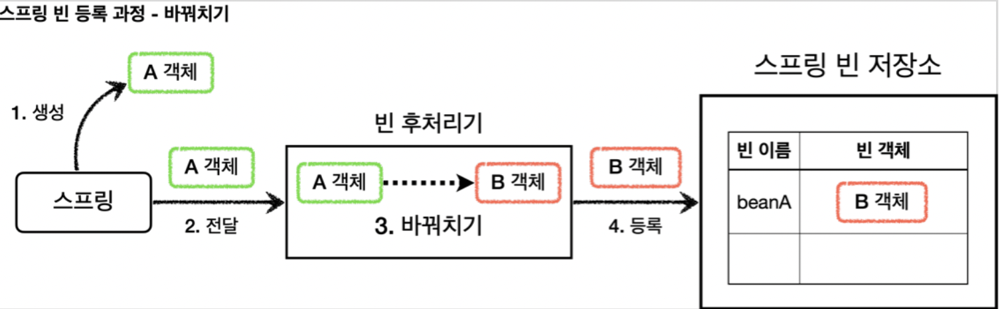
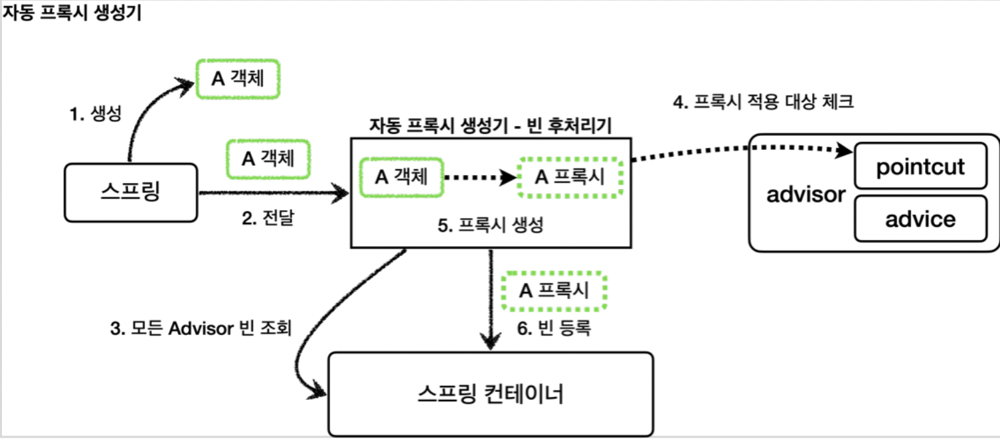

[인프런 김영한님 강의 - 스프링_고급](https://www.inflearn.com/course/%EC%8A%A4%ED%94%84%EB%A7%81-%ED%95%B5%EC%8B%AC-%EC%9B%90%EB%A6%AC-%EA%B3%A0%EA%B8%89%ED%8E%B8/dashboard)


# 07 빈 후처리기

#### 필요성

앞에서 남은 문제점들 중 컴포넌트 스캔의 대상이 되는 객체는 프록시 객체를 생성할 수 없다는 것이였는데, 만약 빈 생성 시점에서 프록시 객체로 바꿔치기를 할 수 있다면?


## 07-1 빈 후처리기란?



실제 원하는 그대로 작동한다.


#### 예제

```java
    @Slf4j
    static class AToBPostProcessor implements BeanPostProcessor {

        @Override
        public Object postProcessAfterInitialization(Object bean, String beanName) throws BeansException {
            log.info("beanName={} bean={}",beanName,bean);
            if (bean instanceof A) {
                return new B();
            }
            return bean;
        }
        //지금 이상황은 빈생성시점에 빈에대한 처리를 다루는 작업임.
    }
```

+ `BeanPostProcessor` 를 구현하고, 스프링 빈으로 등록하면된다. ->등록을 해야 스프링 컨테이너가 빈 후처리기를 알아서 작동시킨다.

+ `postProcessBeforeInitialization` 과 `postProcessAfterInitialization` 가 있는데 기본적으로 default 메서드이며, 필요한것을 오버라이딩 하면되는데, `@PostConstruct` 전후 로 호출 타이밍을 잡을 수 있게한다.


```java
    @Test
    void basicConfig() {
        AnnotationConfigApplicationContext applicationContext = new AnnotationConfigApplicationContext(BasicConfig.class);

        //A는 빈으로 등록 된다.
        A a = applicationContext.getBean("beanA", A.class);
        a.helloA();

        //Assertions.assertThatThrownBy()

        Assertions.assertThrows(NoSuchBeanDefinitionException.class, () -> applicationContext.getBean(B.class));
    }
```

+ A 를 빈으로 등록했는데 실제 객체는 B 객체가 등록 되었다.


> 참고 ) @PostConstruct 는 스프링이 자동으로 등록하는 빈 후처리기 `CommonAnnotationBeanPostProcessor` 를 사용한다.

<br>

## 07-2 예제 적용

```java
@Slf4j
public class PackageLogTracePostProcessor implements BeanPostProcessor {

    private final String basePackage;
    private final Advisor advisor;

    public PackageLogTracePostProcessor(String basePackage, Advisor advisor) {
        this.basePackage = basePackage;
        this.advisor = advisor;
    }

    @Override
    public Object postProcessAfterInitialization(Object bean, String beanName) throws BeansException {
        log.info("param beanName={} bean={}",beanName,bean.getClass());


        //프록시 적용대상여부 체크
        //프록시 적용대상이 아니면 원본을 그대로 진행
        String packageName = bean.getClass().getPackageName();
        if (!packageName.startsWith(basePackage)) {
            return bean;
        }

        //프록시 대상이면 프록시를 만들어서 반환
        ProxyFactory proxyFactory = new ProxyFactory(bean);
        proxyFactory.addAdvisor(advisor);

        Object proxy = proxyFactory.getProxy();

        log.info("create proxy: target={} proxy={}",bean.getClass(),proxy.getClass());
        return proxy;
    }
}
```

+ 패키지 경로를 필터링하여 프록시를 생성한다. 또한, 어드바이저를 외부에서 주입받아서 유동적으로 프록시를 생성


#### 빈등록

```java
@Slf4j
@Configuration
@Import({AppV1Config.class, AppV2Config.class})
public class BeanPostProcessorConfig {

    @Bean
    public PackageLogTracePostProcessor logTracePostProcessor(LogTrace logTrace) {
        return new PackageLogTracePostProcessor("hello.proxy.app", getAdvisor(logTrace));
    }

    private Advisor getAdvisor(LogTrace logTrace) {
        //Pointcut
        NameMatchMethodPointcut pointcut = new NameMatchMethodPointcut();
        pointcut.setMappedNames("request*","order*","save*");

        LogTraceAdvice advice = new LogTraceAdvice(logTrace);

        DefaultPointcutAdvisor advisor = new DefaultPointcutAdvisor(pointcut, advice);
        return advisor;
    }
}
```

+ 빈 후처리기를 빈으로 등록해서 더 이상 수동 등록하는 빈 포함, 컴포넌트 스캔으로 등록까지 프록시를 다루지 않아도 된다.


정리)

이제 빈 후처리기를 통해 프록시도 다 생성하고, 원래 목표였던 로그 추적기도 원본 코드 수정 없이 적용 할 수 있게 되었다.

하지만 개발자의 욕심은 끝이 없다. 

더 편리한 사용을 위해 빈 후처리기를 스프링이 자동으로 등록해두었고, 적용 대상 여부를 포인트컷을 이용해 더 간단하면서도, 사용성 좋게 처리할 수있다.

<br>

## 07-3 스프링이 제공하는 빈 후처리기

`implementation 'org.springframework.boot:spring-boot-starter-aop'` 를 추가해서 `aspectJ` 관련 라이브 등록 및, `AOP` 관련 클래스를 스프링 빈에 등록해야한다.


#### 자동 프록시 생성기 - AutoProxyCreator

+ 스프링 부트는 `AnnotationAwareAspectJAutoProxyCreator` 를 자동으로 등록한다.

+ 어쩌라는 건가 싶지만, 놀랍게도 `Advisor` 를 빈으로 등록하는 것만으로 자동으로 프록시를 적용한다.

+ 이게 가능한 이유는 `Advisor` 안에 Pointcut과 Advice가 포함 되어있기 때문이다 .어디에 무엇을 적용해야하는지 알고 있기 떄문이다.


#### 작동과정



모든 `Advisor`를 조회하고, 그 `Advisor` 에 포함된 포인트컷으로 프록시 적용 대상 여부를 판단한다. 조건 하나라도 만족하면 프록시를 생성하고, 조건을 만족하지않으면 프록시를 적용하지않는다.


#### 예제 적용

```java
@Configuration
@Import({AppV1Config.class, AppV2Config.class})
public class AutoProxyConfig {

    @Bean
    public Advisor advisor3(LogTrace logTrace) {

        AspectJExpressionPointcut pointcut = new AspectJExpressionPointcut();
        pointcut.setExpression("execution(* hello.proxy.app..*(..)) && !execution(* hello.proxy.app..noLog(..))");
        //실무에선 AspectJExpression 많이씀

        LogTraceAdvice advice = new LogTraceAdvice(logTrace);
        DefaultPointcutAdvisor advisor = new DefaultPointcutAdvisor(pointcut, advice);
        return advisor;
    }
}
```

포인트컷을 `AspectJExpression` 을 사용해서 정밀하게 지정해줄 수 있다. 

여러개의 어드바이저를 등록할 수 있다. 이때, 프록시는 무조건 하나만 생성된다는 것을 명심해야한다.


#### 중요 - 포인트컷의 사용

포인트컷은 두 곳의 사용포인트가 있다.

1. **생성 시점 - 프록시 적용 여부 판단**
   
   + 프록시를 생성할지 말지에 대한 여부를 판단한다. 포인트컷을 하나라도 만족학면 프록시 객체를 생성한다.

2. **사용 시점 - 어드바이스 적용 여부 판단**
   
   + 프록시 호출시 어드바이스 적용여부를 판단한다.


