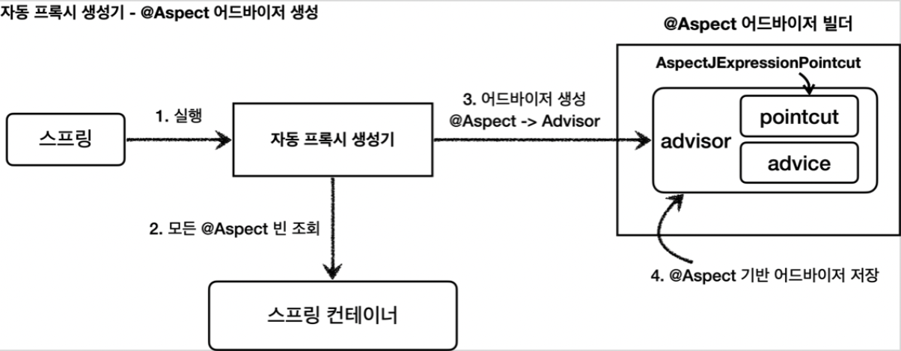
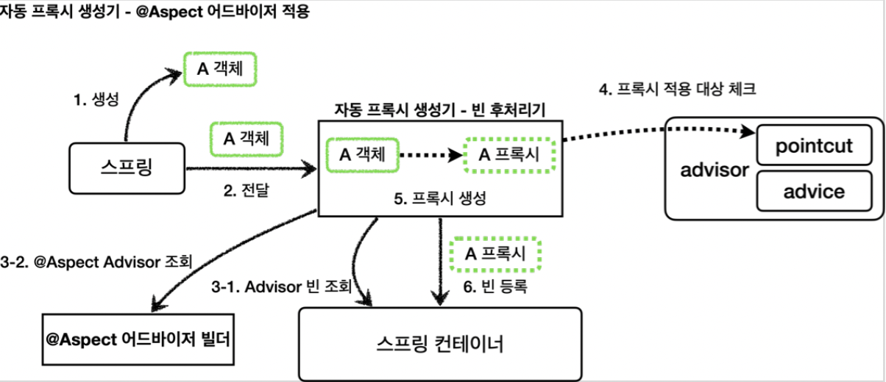

[인프런 김영한님 강의 - 스프링_고급](https://www.inflearn.com/course/%EC%8A%A4%ED%94%84%EB%A7%81-%ED%95%B5%EC%8B%AC-%EC%9B%90%EB%A6%AC-%EA%B3%A0%EA%B8%89%ED%8E%B8/dashboard)

# 08 @AspectAOP

앞장에서 빈으로 `Advisor` 를 등록하면 자동 프록시 생성기가 자동으로 처리해준다는 것을 배웠다. @Aspect 어노테이션을 이용하면 , 매우 편리하게 어드바이저를 생성할 수 있다. 

보통 보면 어노테이션을 적용하는 단계까지 오면 가장 진화한 형태인것 같다. 어디까지나 나의 사견이지만

## 08-1 예제에 바로 적용

```java
@Slf4j
@Aspect
public class LogTraceAspect {

    private final LogTrace logTrace;

    public LogTraceAspect(LogTrace logTrace) {
        this.logTrace = logTrace;
    }

    @Around("execution(* hello.proxy.app..*(..))") //포인트컷 역
    public Object execute(ProceedingJoinPoint joinPoint) throws Throwable{
        TraceStatus status = null;
        try {
            String message = joinPoint.getSignature().toShortString();
            status = logTrace.begin(message);

            //로직 호출
            Object result = joinPoint.proceed();
            logTrace.end(status);

            return result;
        } catch (Exception e) {
            logTrace.exception(status,e);
            throw e;
        }
    }
}
```

+ 기존에 어드바이저를 만들기위해 포인트컷, 어드바이스를 따로 주입받아 디폴트 어드바이저를 직접 생성해서 반환했던것을 생각하자. 그에반해 어노테이션으로 쉽게 그리고, 직관적으로 만들 수있다.
+ 쉽게 생각해서 `@Aspect` 를 하나의 어드바이저로 (물론 어드바이스가 여러 개 등록가능) , `@Around` 를 포인트컷, `@Around` 가 붙은 메서드를 어드바이스로 생각하면된다.

#### ProceedingJoinPoint

다음장에서 조인 포인트에대해 구체적으로 배우지만 정리하는김에 미리 감을 잡으려한다.

우선 `ProceedingJoinPoint` 는 `JoinPoint` 를 상속받는 인터페이스이다. 뒷장에서 나오지만 Proceeding 이라는 단어는 `proceed()` 메서드와 관련있다. 즉, 실제 호출대상에 대한 정보를 가지고 있다. `JoinPoint` 에는 이 정보가 포함되어있지않다. 

#### 빈 등록

`@Aspect` 어노테이션 자체는 컴포넌트 스캔의 대상이 아니므로 꼭 빈등록을 해주어야한다.

```java
@Configuration
@Import({AppV1Config.class, AppV2Config.class})
public class AopConfig {

    @Bean
    public LogTraceAspect logTraceAspect(LogTrace logTrace) {
         return new LogTraceAspect(logTrace);
    }
}
```

<br>

## 08-2 @Aspect 프록시 이해

앞에서 자동 프록시 생성기가 `Advisor` 를 찾아서 프록시를 생성사고, 적용해준다고 했다.

그렇다면 @Aspect는 어떻게 동작하는가?

#### 자동 프록시 생성기의 비밀

스프링 부트에 등록되는 자동 프록시 생성기의 클래스명은 `AnnotationAwareAspectJAutoProxyCreator` 이다. 즉, 어노테이션 을 인식 한다는 뜻이다.

자동 프록시 생성기가 하는일 

+ `@Aspect` 를 인식해서 `Advisor`로 만들어준다.

+ 어드바이저를 기반으로 프록시 생성

#### @Aspect를 인식해서 Advisor로



동작 순서

+ 애플리케이션 로딩 시점에 자동프록시 생성기 호출

+ `@Aspect` 가 붙은 모든 스프링 빈 조회

+ `@Aspect` 어드바이저 빌더 를 통해 어드바이저 생성

+ <u>생성한 어드바이저를 어드바이저 빌더 내부에 저장</u>

```java
    @Nullable
    private volatile List<String> aspectBeanNames;

    private final Map<String, List<Advisor>> advisorsCache = new ConcurrentHashMap<>();
```

실제 `BeanFactoryAspectJAdvisorsBuilder` 내부의 필드 인데, aspectBeanNames 을 키로 가지는 `Advisor` 리스트 value의 맵형태로 저장되는 것 같다.

#### 어드바이저를 기반으로 프록시 생성



동작순서

+ 빈 객체 생성

+ 스프링 컨테이너에 등록되기 전에 후처리기에 전달

+ 스프링 컨테이너에서 `Advisor` 조회

+ `@Aspect` 어드바이저 빌더 내부의 `Advisor`모두 조회

+ 위의 모든 `Advisor` 의 `pointcut` 을 메서드 중 하나라도 일치하면 프록시 적용

+ 프록시를 스프링빈으로 등록
