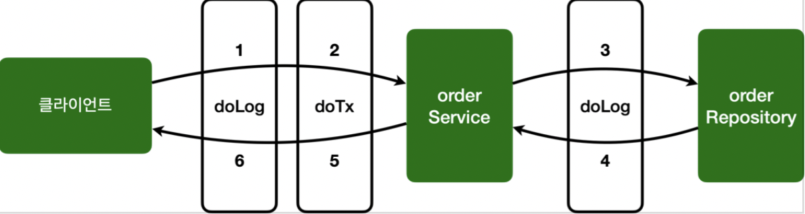

[인프런 김영한님 강의 - 스프링_고급](https://www.inflearn.com/course/%EC%8A%A4%ED%94%84%EB%A7%81-%ED%95%B5%EC%8B%AC-%EC%9B%90%EB%A6%AC-%EA%B3%A0%EA%B8%89%ED%8E%B8/dashboard)

# 10 스프링 AOP 구현

예제로 여러가지 Aspect를 만들어보면서 감을 익힌다.

## 10-1 AspectV1 - 가장 간단한 Aspect

```java
@Slf4j
@Aspect
public class AspectV1 {

    @Around("execution(* hello.aop.order..*(..))")
    public Object doLog(ProceedingJoinPoint joinPoint) throws Throwable {
        log.info("[log] {}", joinPoint.getSignat
```

`@Around("execution(* hello.aop.order..*(..))")` : 포인트컷

`public Object doLog(){}` : 어드바이스

구조를 빨리 확인해야 직관적으로 읽힌다.

<br>

## 10-2 AspectV2 - 포인트컷의 분리

```java
@Slf4j
@Aspect
public class AspectV2 {

    //hello.aop.order 패키지와 그 하위 패키지
    @Pointcut("execution(* hello.aop.order..*(..))")
    private void allOrder(){} //pointcut signature 라고 한다.
    //포인트컷 재사용이 가능함을 의미
    //다른 Aspect에서 사용하려면 접근 제어자 열면됨.

    @Around("allOrder()")
    public Object doLog(ProceedingJoinPoint joinPoint) throws Throwable {
        log.info("[log] {}", joinPoint.getSignature());
        //getSignature() -> 메서드 정보

        // ex) void hello.aop.order.OrderService.orderItem(String)
        return joinPoint.proceed();
    }
}
```

포인트컷을 분리 할 수 있다. 이때, 이름은 아무렇게나 해도 되지만 따로 호출한다는 것을 알고 있자.

포인트컷을 분리하면 재사용을 할 수 있다.

`allOrder()` 이런식으로 표현하는 것을 <u>포인트컷 시그니쳐</u> 라고 한다.

접근제어자의 경우, 다른 `Aspect` 에서 사용하는 경우 `public` 으로 사용하면 된다.

<br>

## 10-3 AspectV3 - 복잡한 Aspect

```java
@Slf4j
@Aspect
public class AspectV3 {

    //포인트    
    @Pointcut("execution(* hello.aop.order..*(..))")
    private void allOrder(){}

    //클래스 이름 패턴이 *Serivce -> 트랜잭션은 보통 서비스에서 일어나는 경우가 많으므로
    @Pointcut("execution(* *..*Service.*(..))")
    private void allService(){}

    //어드바이저1
    @Around("allOrder()")
    public Object doLog(ProceedingJoinPoint joinPoint) throws Throwable {
        log.info("[log] {}", joinPoint.getSignature());

        return joinPoint.proceed();
    }

    //어드바이저2
    @Around("allOrder() && allService()")
    //hello.aop.order 패키지와 하위패키지이면서 클래스이름패턴이 *Service인것
    public Object doTransaction(ProceedingJoinPoint joinPoint) throws Throwable {

        try {
            log.info("[트랜재션 시작] {}", joinPoint.getSignature());

            Object result = joinPoint.proceed();

            log.info("[트랜재션 종료] {}", joinPoint.getSignature());

            return result;
        } catch (Exception e) {
            log.info("[트랜잭션 롤백 {}]",joinPoint.getSignature());
            throw e;
        } finally {
            log.info("[리소스 릴리즈 {}]",joinPoint.getSignature());

        }
    }
}
```

+ 기존 로그를 찍는 어드바이스와 트랜잭션을 처리하는 어드바이스를 추가했다. 
+ 이 예제에서 확인 할 수 있는것은 포인트컷을 조합해서 사용이 가능하다는 것이다.
  + &&(And), ||(Or) , !(Not)  사용 가능

#### 실행 흐름



현재 doLog() -> doTransaction() 순으로 어드바이스가 적용이되는데 만약 이순서를 바꾸고 싶으면 어떡할까?

그전에 포인트컷을 외부에서 참조하는 방법을 알아보자.

<br>

## 10-4 Aspect V4 - 포인트컷 외부참조

```java
@Slf4j
@Aspect
public class AspectV4Pointcut {

    @Around("hello.aop.order.aop.PointCuts.allOrder()")
    public Object doLog(ProceedingJoinPoint joinPoint) throws Throwable {
        log.info("[log] {}", joinPoint.getSignature());

        return joinPoint.proceed();
    }

    @Around("hello.aop.order.aop.PointCuts.orderAndService()")
    //hello.aop.order 패키지와 하위패키지이면서 클래스이름패턴이 *Service인것
    public Object doTransaction(ProceedingJoinPoint joinPoint) throws Throwable {

        try {
            log.info("[트랜재션 시작] {}", joinPoint.getSignature());

            Object result = joinPoint.proceed();

            log.info("[트랜재션 종료] {}", joinPoint.getSignature());

            return result;
        } catch (Exception e) {
            log.info("[트랜잭션 롤백 {}]",joinPoint.getSignature());
            throw e;
        } finally {
            log.info("[리소스 릴리즈 {}]",joinPoint.getSignature());

        }
    }
}
```

+ 포인트컷을 공용으로 사용하기위해 외부 클래스에 모아 두었다고 하자. 이때 외부참조를 할때는 <u>패키지명+ 클래스명+ 포인트컷시그니쳐</u>을 모두 적어주어야한다. 물론 포인트컷은 Public으로 열려있어야한다.

<br>

## 10-5 AspectV5 - 어드바이스 순서 지정

어드바이스의 순서를 지정하는 방법에는 좀 내키지 않는 방법이 하나 있다.`@Order` 를 적용하는 것이다.

바로 Aspect단위로 밖에 적용된다는 것이다. 즉, 메서드 단위가 아닌 클래스 단위로 적용된다.

그렇다면 어드바이스를 각각의 Aspect로 분리하는 것은 불가피하다는 것이다.

```java
@Slf4j
public class AspectV5Order {

    @Aspect
    @Order(2)
    public static class LogAspect{
        @Around("hello.aop.order.aop.PointCuts.allOrder()")
        public Object doLog(ProceedingJoinPoint joinPoint) throws Throwable {
            log.info("[log] {}", joinPoint.getSignature());

            return joinPoint.proceed();
        }
    }

    @Aspect
    @Order(1)
    public static class TransactionAspect{
        @Around("hello.aop.order.aop.PointCuts.orderAndService()")
        public Object doTransaction(ProceedingJoinPoint joinPoint) throws Throwable {

            try {
                log.info("[트랜잭션 시작] {}", joinPoint.getSignature());

                Object result = joinPoint.proceed();

                log.info("[트랜잭션 종료] {}", joinPoint.getSignature());

                return result;
            } catch (Exception e) {
                log.info("[트랜잭션 롤백 {}]",joinPoint.getSignature());
                throw e;
            } finally {
                log.info("[리소스 릴리즈 {}]",joinPoint.getSignature());

            }
        }
    }
}
```

그래도 어느 정도 한곳에 모아서 응집성을 높히고 싶다면 하나의 클래스로 두되 , 내부클래스로 각각 `@Aspect`를 붙히는 것이다. 

`@Order` 가 낮은 순으로 먼저 실행된다.

<br>

## 10-5 AspectV6 - 어드바이스의 종류

```java
@Slf4j
@Aspect
public class AspectV6advice {

    @Before("hello.aop.order.aop.PointCuts.allOrder()")
    public void doBefore(JoinPoint joinPoint) {
        log.info("[before] {}", joinPoint.getSignature());
    }

    @AfterReturning(value = "hello.aop.order.aop.PointCuts.allOrder()", returning = "result")
    public void doReturn(JoinPoint joinPoint, Object result) {
        log.info("[return] {} return={}", joinPoint.getSignature(), result);
    } //리턴값 바꿀 수 없음

    @AfterThrowing(value = "hello.aop.order.aop.PointCuts.allOrder()", throwing = "ex")
    public void doThrowing(JoinPoint joinPoint, Exception ex) {
        log.info("[ex] {} message = {}", joinPoint.getSignature(), ex);
    }

    @After(value = "hello.aop.order.aop.PointCuts.allOrder()")
    public void doAfter(JoinPoint joinPoint) {
        log.info("[after] {}",joinPoint.getSignature());
    }

}
```

+ `@Before` : 조인포인트 이전에 실행 된다. 특이한 점은 매개변수로 `ProceedingJoinPoint` 를 넘겨 받는 다는것이다. 즉, `Target` 에 대한 정보가 전혀 필요없다는 뜻
  
  + 작업 흐름을 변경 할 수 없다.
  
  + 메서드가 종료되면 자동으로 타겟이 호출된다.

+ `@AfterReturning` : 조인포인트 <u>정상완료</u> 후 실행 , 실행결과를 매개변수로 넘겨받을 수 있다.
  
  + `returning` 속성에 사용된이름과 매개변수의 이름이 일치해야한다.
  
  + 반환객체를 변경 할 수없다. 조작불가.

+ `@AfterThrowing` : 메서드가 예외를 던지는 경우 실행된다.

+ `@After` :정상 실행 또는 예외 발생 모든 경우에 실행 된다. finally같은 놈

> 참고로 @Around는 저위에 있는 놈들을 모두 모아놓은 통합판이라고 생각하면된다. 일반적으로 가장 많이 사용된다.
> 
> 또, 가장 강력한 어드바이스 종류로서, 작업흐름을 임의로 조작하고, 반환 값이나 예외 들을 변환할 수 있다.

## 10-6 기타

위에서 @Around가 통합판이고 , 가장 강력한 기능이라고 설명했다. 그렇다면 나머지 종류들은 필요없는 것이 아닌가?

@Around에는 사소하지만 중요한 리스크가 있다.

```java
@Around("hello.aop.order.aop.Pointcuts.orderAndService()")
public void doBefore(ProceedingJoinPoint joinPoint) {
     log.info("[before] {}", joinPoint.getSignature());
}
```

이경우 문제점은?

바로 `joinPoint.proceed()` 가 없다는 것이다. 즉, 흐름이 멈춰버렸다. 의도 했을 수도 있지만 만약 실수라면 런타임에러 이므로 큰장애로 이어진다. 

개발에서는 제약이 없는 것도 문제가된다. 

좋은 설계는 제약이 있다.

반면 `@Before` 를 사용한다면? 이부분을 고려하지 않아도 된다. 그리고  코드의 의도또한 명확해 질 것이다.
