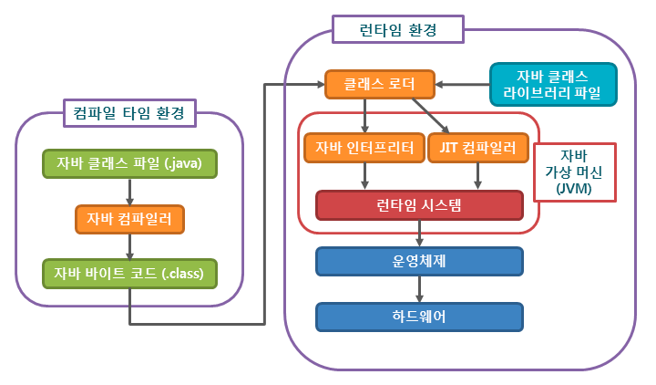

# 📍main topic: 객체지향 프로그래밍의 특징
> ✅ 주요 키워드 : class loader, jvm, compiler/interpreter

## 컴파일 전체 과정 정리

1. 개발자가 자바 소스 코드(`.java`) 작성
2. 자바 컴파일러가 컴파일하여 `.class`파일 생성. 이때 `.class` 파일은 컴퓨터가 읽을 수 는 없고,
자바 가상머신(`jvm`) 이 이해할 수 있는 **바이트코드**이다.
3. 컴파일 된 바이트 코드를 `jvm` 클래스로더에게 전달 
----
4. 클래스 로더는 동적로딩(`Dynamic Loading`)을 통해 필요한 클래스들을 로딩 및 링크하여 런타임 데이터 영역(`Runtime Data area`), 즉 JVM의 메모리에 올린다.
5. 실행엔진(`Execution Engine`)은 JVM 메모리에 올라온 바이트 코드들을 명령어 단위로 하나씩 가져와서 실행한다. 이때, 실행 엔진은 두가지 방식으로 변경한다.

## 클래스로더
클래스로더의 역할은 필요한 클래스를 메모리에 적재하는 것이다. 자바는 기본적으로
동적로딩을 수행한다. 동적로딩 클래스 참조시점 JVM으로 클래스가 로드되는것을 말한다.

+ 특징
  + 계층적 구조를 지닌다.(`BootStrap` -> `Extenstion` -> `Application`)
  + 로딩 -> 링킹 과정을 거친다.

+ 3가지 원칙
  + Delegation Principle
  + Visibility Principle
  + Uniqueness Principle

