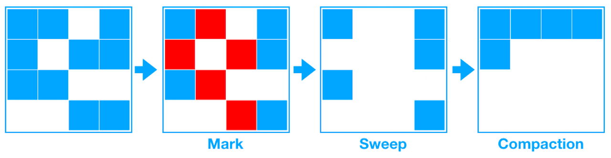
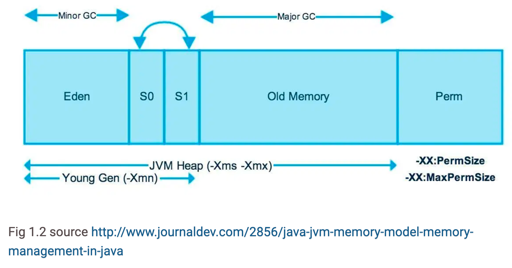
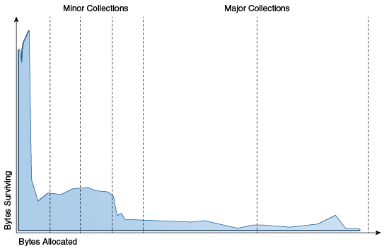

# 📍main topic : 자바 Gabage Collector의 동작원리와 과정
> ✅ 주요 키워드 : Heap Memory, Minor/Major GC, etc

## 가비지 컬렉션이란?
프로그램은 메모리에 의존하여 실행하게된다. 우리가 생성한 모든 객체들은 메모리 어딘가에 저장되어야 한다.
메모리는 무한하지 않기때문에 사용되지 않는 메모리는 해제하여 관리되어야만한다.
옛날의 언어들, 예를들어 `C언어`의 경우 프로그래머가 수동으로 메모리를 관리하지만
최근 대부분의 언어들은 `Garbage Collection`방식을 사용하여 메모리를 자동으로 관리하는 방법을 선택한다.

> 가비지 컬렉션이란 동적으로 할당했던 메모리중 필요없게된 메모리 객체를 모아 주기적으로 제거하는 프로세스를 말한다.

## STOP-THE-WORLD
어떤 방식으로 GC가 동작하던지에 상관없이 모든 GC가 동작하는 동안은 GC를 제외한
JVM의 모든 스레드가 멈추게된다. 따라서 이 시간은 GC를 사용할 때의 오버헤드에
가장 큰 영향을 미치게된다.

## GC의 동작 알고리즘 
GC의 동작 알고리즘에는 대표적으로 `Reference Counting`과 `Mark And Sweep`이 있다.
`Reference Counting`은 객체에 접근하는 방법을 카운팅함으로써 접근하는 방법이 0이라면
사용중이 않음으로 판단하여 이를 제거하는 방식이다. 하지만, 순환 참조에서 한계점이 있다.
이를 보완하는것이 `Mark And Sweep`기법이다. 

## Mark And Sweep 기법

### GC의 대상(target)
가비지 컬렉터는 제거해야할 대상을 어떻게 판별하는가? 그 구분의 기준은 `Reachability`라는 개념을 이용한다.
즉 객체는 제거 해야할 대상의 여부를 두가지로 판별한다.
+ `Reachable` : 객체가 참조되고 있는 상태
+ `Unreachable` : 객체가 참조있지 않는 상태 --> `GC`의 대상

### Mark
가비지컬렉터는 모든 객체를 `unreachable`상태로 가정한다.
**루트 스페이스**(전역변수, 스택의 변수 등 참조변수)로부터 시작하여 도달 가능한 
모든 객체를 `Reachable`로 식별한다.(마킹한다.)

> 힙에 있는 객체들의 참조 종류
> 1. 힙 내의 다른 객체에 의한 참조
> 2. Java 스택, 즉 Java 메서드 실행 시에 사용하는 지역 변수와 파라미터들에 의한 참조
> 3. 네이티브 스택, 즉 JNI(Java Native Interface)에 의해 생성된 객체에 대한 참조
> 4. 메서드 영역의 정적 변수에 의한 참조
>   1번을 제외한 나머지가 root set으로 reachability를 판가름하는 기준이 된다.

### Sweep
마크 단계에서 마킹 되지않은 객체(unreachable)를 식별하여 메모리를 해제한다.

## JVM의 GC
GC는 오버헤드가 큰 작업이다. GC를 설계할때 가장 크게 고려해야할 사항은 
**언제 GC가 동작할지**, **어떻게 GC가 동작할지** 일것이다.
자바의 Heap 메모리 구조를 보면 그 고민의 결과를 자세하게 알 수 있다.

기본적으로 `Young Gen`과 `Old Gen`으로 나누어진다. GC의 결과로 부터 살아남은
객체는 최초 `Young Gen`에서 `Old Gen`으로 이동하는 방식의 흐름을 갖는다.

### 왜 이런식으로 구분 지었을까?
이는 두가지 전제를 근거로 설계 되었다.
+ 대부분의 객체는 금방 접근 불가능한 상태(Unreachable)가 된다.
+ 오래된 객체에서 새로운 객체로의 참조는 아주 적게 존재한다.

즉 객체의 대부분은 일회성이며, 메모리에 오랫동안 머무르는 경우는 굉장히 드물다는 것이다.
따라서 **객체의 수명에 따라 구분하여 관리하고 GC를 개별적으로 진행한다면 오버헤드를 줄일 수 있는것이다.**

### Minor GC 동작과정
1. 새로 생성된 객체는 `Young Gen`의 `Eden`영역에 저장된다. 만약 `Eden`영역이 꽉차게 된다면
`Minor GC`가 발생한다.
2. 이때, `Eden`영역의 `Reachable`한 객체는 `Survivor`영역으로 이동하게된다.
> Survivor영역은 두개의 영역으로 나누어지는데 이는 계층적구조가 아니다. 항상 한곳은 비워져있어야하며
살아남은 객체를 빈 Survivor영역으로 위치시킨다.
3. [1,2]번 과정이 반복되면서 객체의 age가 특정 횟수를 초과하면 `Old Gen`으로 이동하게된다.
이것을 `Promotion`이라고 칭한다.

### Major GC 동작과정
`Promotion`된 객체는 `Old Gen` 영역으로 이동한다. 만약 `Old Gen`영역이 다찬다면 `Full GC`가 이루어지게된다.
일반적으로 `Old`영역은 `Young` 영역보다 크기가 크기 때문에 더 빠르게 시간이 굉장히 많이 소요된다.
즉, GC의 오버헤드를 가장 크게 차지하는 요소이며, Major GC의 시간을 짧게 유지하고
`Promotion`되는 객체를 최소화하여 횟수를 줄여야한다.

