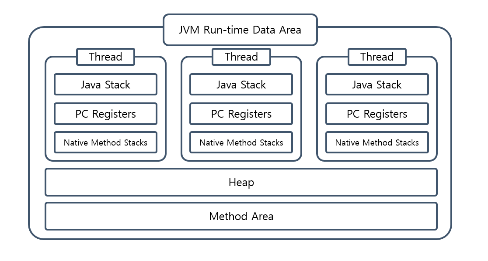
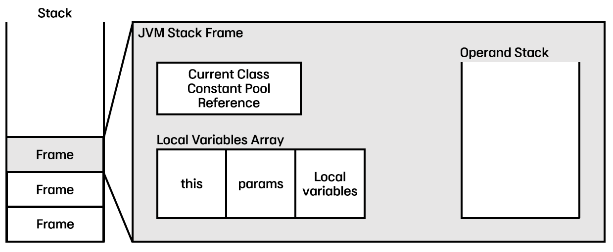

# 📍main topic : JVM 메모리 구조
> ✅ 주요 키워드 : Method Area, Heap , Stack etc..

## JVM Run-time Data Area

JVM의 메모리 영역으로 애플리케이션을 실행할때 사용되는 데이터들을 적재하는 영역이다.
`Method Area`와 `Heap`영역은 모든 쓰레드가 공유하는 영역이며 
나머지는 각 쓰레드마다 개별적으로 생성된다.

## Method Area
메서드영역은 JVM이 시작될때 생성되며 클래스로더에 의해 로드된 클래스의 바이트 코드가 위치하는 곳이다.
다음과 같이 구성된다.

+ Type information
  + 클래스,인터페이스에 대한 모든 정보
+ Constant Pool
  + 메서드, 필드에 대한 모든 Refernce를 담고있다.(Symbolic Reference)
  + 인덱스를 통해 접근가능
+ Field Information
  + Class 멤버 변수의 이름 및 데이터 타입, 접근 제어자에 대한 정보를 저장
+ Method Information
  + Class 멤버 메서드의 이름, 리턴 타입, 매개변수, 접근제어자에 대한 정보
+ Class Variable
  + static으로 선언되는 모든 클래스 변수
  + 이 변수는 모든 Instance에서 접근 가능하기 때문에 동기화 이슈가 발생할 수 있음
  + Class Variable을 final로 선언할 경우에는 Constant Pool에 저장
+ Reference to ClassLoader & class Class
  + 특정 클래스를 로드한 클래스로더의 정보를 관리
  + Class object와 서로 양방향 접근을 하기 대문에 Class Object에 대한 참조 주소 값을 가진다
+ Method Table
  + Class의 Method에 대한 Direct Reference를 가진다고 보면 된다
  + Method Table을 이용해 Super Class에서 상속된 Method의 Reference까지 확인이 가능

`Method Area`는 Class에대한 모든 정보가 Byte Code 형태로 로드된다.

## PC(Program Counter) Register
Stack, Native Method Stack과 함께 쓰레드가 생성될 때 각 쓰레드마다 할당되는 영역으로, 현재 수행중인 JVM의 명령어 주소를 저장한다.
만약 실행했던 메소드가 네이티브 하다면 `undefined`로 기록된다.
 

## Stack

`Stack Area`는 쓰레드가 시작될 때 할당되며 내부에는 매소드에서 직접 사용할 지역 변수, 파라미터, 리턴 값, 참조 변수일 경우 주소 값 들이 저장된다.
이때 메서드는 `Frame`의 단위로 `Stack`구조로 쌓이게 된다.
### Frame
프레임은 크게 세가지 요소로 구성된다.
+ Constant Pool Reference 
  + Method Area의 Runtime Constant Pool을 참조한다.
  + 정적 변수의 사용을 가능하게 한다.

+ Local Variables Array
  + this에 대한 reference
  + 매개 변수 저장
  + 원시타입의 값 저장
  + 객체의 참조값 저장

+ operand stack
  + `operand`란 피연산자를 의미한다. 
  + `jvm`은 stack-base 방식의 가상머신이기 때문에 operand stack을 통해 연산을 하게된다.

### VM stack base vs registry base 
JVM은 `stack-base`의 VM이다. 즉, 피연산자는 `operand stack`에 저장되어
값을 가져오거나 계산하고 저장한다. 이는 자바 바이트코드 명령어셋에 스택 관련 동작이 
많다는 점을 유심히 보면 알 수 있다. 그렇다면 `stack base`가 아닌 `registry base` 는 무엇인가?
 
레지스터 기반의 VM은 피연산자를 레지스터에서 가져와서 계산한 뒤 다시 레지스터에 저장한다.
즉 `stack`을 활용하는 것이 아니라 하드웨어 `registry`에 직접 접근하여 값을 관리한다.

+ 레지스터 기반의 VM의 장단점
  + 장점
    + 명령어 수가 적다.(`stack` 관련 명령어가 필요없음)
    + 스택에대한 오버헤드가 없다.
    + 명령어 최적화를 할 수 있다.
  + 단점
    + 명령어의 크기가 커진다.
    + 명령어에 피연사자의 메모리 주소를 명시해야하므로 명령어의 길이가 길어진다.

+ 성능적 차이
  + 연구적 결과로 레지스터 기반 VM이 스택 기반 VM 보다 성능적으로 우위에 있다고 말한다.

+ 그럼에도 자바는 `stack base`의 VM을 선택한 이유?
  + 레지스터 기반의 VM은 `register`에 직접 접근하므로 하드웨어 의존성이 높아진다고 말할 수 있다.
  이때, 접근은 OS의 종류에 의존하므로 JVM의 기본 목표인 플랫폼 독립성에서 멀어지는 것이다.
  + 따라서 상대적으로 하드웨어에 독립성을 가지는 `stack base` VM을 선택한것이라 볼 수 있다.

### Native Memory Stack
Java로 작성된 메서드가 아닌 다른 프로그래밍 언어로 작성된 메서드를 `Native Method`라고 한다.
일반적인 C 스택을 사용한다.

## 참고
https://www.korecmblog.com/blog/jvm-stack-and-register#jvm
https://www.artima.com/insidejvm/ed2/jvm8.html
https://johngrib.github.io/wiki/jvm-stack/#fn:2-5-2
https://velog.io/@impala/JAVA-JVM-Runtime-Data-Area
https://www.youtube.com/watch?v=UzaGOXKVhwU&t=501s
