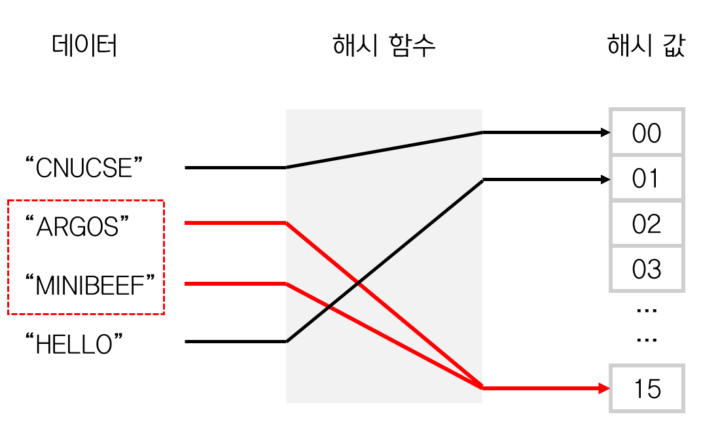

# 📍main topic : HashMap 동작원리와 내부구조에 대해 설명하시오
> ✅ 주요 키워드 : equal/hashCode와의 상관관계 및 성능

## HashMap이란?
HashMap은 데이터를 저장할 때 키(Key)와 밸류(Value)가 짝을 이루어 저장한다. 데이터를 저장할 때는 키(Key) 값으로 해시함수를 실행한 결과를 통해 저장위치를 결정합니다.
따라서 HashMap은 특정 데이터의 저장위치를 해시함수를 통해 바로 알 수 있기 때문에 데이터의 추가, 삭제, 특히 검색이 빠르다는 장점이 있다.

## hash function
임의의 길이를 가진 데이터를 고정된 길이의 해시 값으로 변환하는 함수이다.

### 특징
1. 어떤 입력 값에도 항상 고정된 길이의 해시값을 출력한다.
2. 입력 값의 아주 일부만 변경되어도 전혀 다른 결과 값을 출력한다.(눈사태 효과)  --> 입력값이 같다면 항상 같은 결과값을 가져야한다.
3. 출력된 결괏값을 통해 입력값을 유추할 수 없다.

### 좋은 해시함수란?
연산 속도가 빠르고, 해시값이 최대한 겹치지 않는 함수
<br> 
하지만 이상적으로 1:1매핑 되지않는 이상 해시값이 겹칠 수 밖에 없고, 이것을 <u>해시충돌</u>이라한다.

## hash collision (해시 충돌)

해시함수가 서로 다른 2개의 입력값에 대해 동일한 출력값을 내는 상황을 의미한다. 해시테이블에서
가질 수 있는 키값의 종류의 개수가 테이블 인덱스의 개수보다 많기 때문에 불가피한 충돌을 야기한다.

### 해시충돌 해결방법
#### 1. open addressing 
해시 충돌이 발생하면 미리 정해진 규칙에 따라 비어있는 slot을 찾아서 값을 갱신 하는 방법으로 모든 데이터를 
테이블에 저장한다.
이때 비어있는 slot을 찾는 방법에따라 크게 `Linear Probing`,`Quadratic Probing` , `Double Hashing`등으로 구분 지을 수있다.
+ linear probing(선형 탐사)
  + 충돌 발생시 일정값 만큼 건너 뛰어 빈 slot을 찾는 방법이다
  + 구현이 단순하나 `clustering`이 발생하기 쉽다.
+ quadratic probing(제곱 탐사)
  + 이동 거리를 제곱수 만큼 늘려 `clustering`구간을 줄이는 방식
+ double hashing(이중 해싱)
  + 이동 거리를 결정하는 해시함수를 추가로 사용하여 `clustering`을 최대한 줄이는 방식

> clustering : 해시충돌이 일어나 데이터들이 빈 슬롯을 찾아가는 과정에서 특정 위치에 밀집하는 현상

#### 2. seperate chaining
해시 충돌이 발생한면 해당 해시값의 인덱스의 노드에 연결해 나가는 `Linked List`형태를 취하는 방식

## 자바 hashCode() and equals()
처음 `hashCode`메서드를 접하게 되는 것은 아마도 `Object`클래스일 것이다.
```java
public class Object {
    /**
     * Returns a hash code value for the object. This method is
     * supported for the benefit of hash tables such as those provided by
     * {@link java.util.HashMap}.
     * 생략
     */
    public native int hashCode();

    public boolean equals(Object obj) {
        return (this == obj);
    }
}
```
즉, `hashCode`메서드는 자바에서 사용하는 해쉬함수를 말하고, 메서드를 통해 나오는 값은 객체를 식별하는 정수값이다.
`Object` 클래스는 hashCode를 객체의 메모리 주소를 이용해 해시코드값을 만든다. 또한 `eqauls` 메서드에서는
`==`연산자를 활용하는데, 이것은 참조하고있는 객체의 실제 메모리 주소를 비교하는 것이다.

### hashcode()와 equals()의 오버라이딩
`hash`를 활용한 자료구조 (`HashMap`, `HashSet`)을 사용하기 위해선 해시값을 구하는 hashcode()와
충돌 시 실제 키값의 비교를 위해 `equals`메서드가 필요함은 자명하다.
그렇다면 개발자가 정의한 클래스를 `Object`에 정의 된 메서드만을 이용하여 앞서말한 자료구조들을 사용할 수 있을까?
<br>
당연히 안된다.

```java
public class Korean {
    private String regNo;

    public Korean(String regNo) {
      this.regNo = regNo;
    }
```
모든 한국인들은 고유한 주민번호를 가진다고 가정해보자.
특정 주민번호를 가진 사람의 이름을 바꾸려고 한다고 가정한다.

```java
public static void main(String[] args) {
    HashMap<Korean,String> peoples = new HashMap<>();
    Korean kr1 = new Korean("911111-1111111");
    Korean kr2 = new Korean("911111-1111111");

    peoples.put(kr1, "김발산");
    peoples.put(kr2, "김명호");

    System.out.println(peoples);
    //실행결과 : {Korean@677327b6=김발산, Korean@14ae5a5=김명호}
}
```
사실상 우리가 가정했던 것은 `kr1`과 `kr2`가 같다고 보는 것이다. 그렇지만 현재 클래스내에서 
`equals`메서드가 재정의 되어있지않으므로 `Object`의 `equals`를 사용하기 때문에 객체의 메모리주소를
직접 비교하여 같지 않은 것으로 인식해버린다. 또한 `hashcode`마저 다르게 
.....

----
드디어 본론 
## 자바의 Hash Map 내부구조와 동작원리

