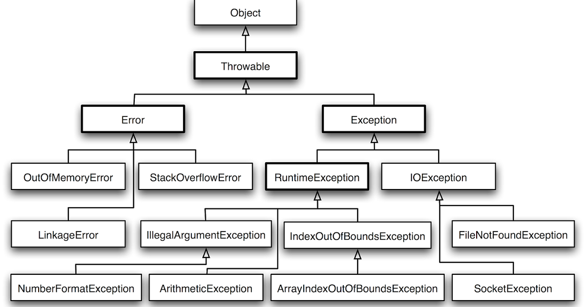

# 📍main topic : Java 예외처리에 대해 설명하시오
> ✅ 주요 키워드 :  error, checked/unchecked exception, try/catch/finally, throws/throw

## 프로그램에서 오류의 종류
1. 컴파일에러 - 컴파일 시에 발생하는 에러
2. 런타임에러 - 실행 시에 발생하는 에러
3. 논리적에러 - 실행은 되지만, 개발자가 의도한대로 실행되지 않을 때.

## 예외 클래스 계층 구조

### Error
애플리케이션이 정상적으로 동작할 수 없는 경우. 개발자가 직접 사용하는 경우는 없으나, 프로그램에
심각한 문제가 있음을 암시하므로 즉각 조치가 필요하다.

### Exception
`Exception`은 크게 `Checked Exception` 과 `UnChecked Exception`으로 나뉜다.

+ `Checked Exception` 
  + 반드시 예외를 처리해야함
  + 컴파일 단계에서 이를 확인함. => 만약 예외처리하지 않을 시 컴파일 에러 발생
  + `Runtime Exception`을 제외한 , `Exception` 클래스와 그를 상속받는 모든 자손 예외
+ `UnChecked Exception`
  + 명시적으로 예외를 처리하지않아도됨
  + 런타임단계에서 확인
  + `Runtime Exception` 과 그 하위 예외

### 명시적 예외처리
1. `try` ~ `catch`
2. `throws`

