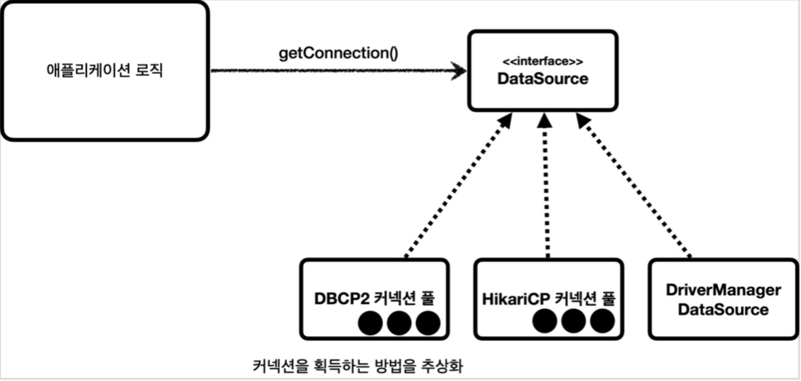

# 📍main topic : JDBC에 대해 설명하시오
> ✅ 주요 키워드 : 드라이버, 트랜잭션, Statement vs PreparedStatement


## 1.JDBC란?
>JDBC는 자바에서 데이터베이스에 접속할 수 있도록 하는 자바 API

데이터베이스의 종류는  수 없이 많기 때문에 자바 어플리케이션과 데이터베이스간의 연결, 질의 , 응답을
표준화 할 필요가 있었기에 JDBC는 이들에 대한 표준을 제공한다. 관련 클래스들은 `java/sql` 패키지에 정의 되어있다.

## 2.DB와의 연결


`jdbc`는 java와 db를 연결하는 중요한 통신 수단이다. 그 수단은 여러가지 방법이 존재한다.
대표적으로는 
1. `DriverManager`를 사용한 방식
2. `ConnectionPool`을 사용한 방식
3. 이를 모두 추상화한 `DataSource`를 사용한 방식

이들의 목적은 결국 `Connection`구현체를 얻어 필요한 질의(`sql`)을 요청하는 데 있다.

### Connection
```java 
package java.sql;

import java.util.Properties;
import java.util.concurrent.Executor;

/**
 * <P>A connection (session) with a specific
 * database. SQL statements are executed and results are returned
 * within the context of a connection.
 * 
 * 
 * **/

public interface Connection  extends Wrapper, AutoCloseable {
    Statement createStatement() throws SQLException;
    PreparedStatement prepareStatement(String sql)
        throws SQLException;
    CallableStatement prepareCall(String sql) throws SQLException;
    String nativeSQL(String sql) throws SQLException;
    void setAutoCommit(boolean autoCommit) throws SQLException;
    boolean getAutoCommit() throws SQLException;
    void commit() throws SQLException;
    void rollback() throws SQLException;
    void close() throws SQLException;
    //...
}
```
결국 이 `Connection`인터페이스를 구현한 구현체에서 우리가 원하는 작업을 수행할 수 있는 것이다.

### DriverManager를 사용한 방식
```java
package java.sql;

public interface Driver {
    Connection connect(String url, java.util.Properties info) throws SQLException;
    boolean acceptsURL(String url) throws SQLException;
    DriverPropertyInfo[] getPropertyInfo(String url, java.util.Properties info) throws SQLException;
    int getMajorVersion();
    int getMinorVersion();
    boolean jdbcCompliant();
}
```
`Driver`는 실제 DB와의 연결을 담당한다. 자바는 `Driver`를 인터페이스로 추상화 시켰고,
실제 벤더들이 구현체를 제공하게 된다. 

```java
package org.h2;

public class Driver implements java.sql.Driver, JdbcDriverBackwardsCompat {
    //..
    static {
        load();
    }

    @Override
    public Connection connect(String url, Properties info) throws SQLException {
        if (url == null) {
            throw DbException.getJdbcSQLException(ErrorCode.URL_FORMAT_ERROR_2, null, Constants.URL_FORMAT, null);
        } else if (url.startsWith(Constants.START_URL)) {
            return new JdbcConnection(url, info, null, null, false);
        } else if (url.equals(DEFAULT_URL)) {
            return DEFAULT_CONNECTION.get();
        } else {
            return null;
        }
    }
    //..
}
```
위의 드라이버는 `h2`DB에서 사용하는 드라이버이다. 실제 구현체에서 얻을 수 있는 정보는
`Driver`는 `url`, `id`, `pw` 등의 접속 정보를 매개변수로 하여 유효성을 검증한 뒤,
`Connection`을 생성 후 반환 하는 역할을 한다. 

실제 사용은 `DriverManager`를 통해 이루어진다. `DriverManager`는 등록된 db드라이버들을 관리하고, 커넥션을 
획득하는 기능을 제공한다.

## JDBC transaction
트랜잭션의 직접적인 수행은 `DB`내부에서 일어난다.(ex 락) 하지만 실제 트랜잭션의 범위를 
지정하는 것은 `java`어플리케이션에서 행해야한다.

즉, 그림에서 보듯 우리가 원하는 비지니스로직을 수행하는데 있어서 트랜잭션의 범위를 지정하는 것은
필수적이라는 것이다. 

### 어떻게 transaction을 설정하는가?
이 글의 주제는 JDBC이므로 아주 기초적 방식의 트랜잭션을 알아보자. 
물론 이방식을 사용할 일은 없으며 대부분 스프링의 트랜잭션을 추상화한 방식을 사용할 것이다.


`Connection`인터페이스의 메서드중에 `void setAutoCommit(boolean autoCommit) throws SQLException;`를 확인할 수 있따.
`autoCommit`이라 함은 각 SQL문이 실행 될 때마다 자동으로 커밋되어 
데이터베이스에 변경사항이 즉시 반영됨을 의미한다. 기본적으로 `true`값으로 지정되어있기때문에
우리는 이것을 `false`로 하여 트랜잭션의 범위를 수동으로 지정하는 것이다.

```java
 try {
    connection.setAutoCommit(false); //트랜잭션 시작
    //비즈니스 로직
    bizLogic(connection, fromId, toId, money);

    connection.commit(); //성공 시 커밋
} catch (Exception e) {
    connection.rollback();
    throw new IllegalStateException(e);
} finally {
    release(connection);
}
```

### Statement vs PreparedStatement
둘다 쿼리의 전송의 목적을 가진다. 이둘 이외에 pl/sql을 수행하는 `CallableStatement`도 있다.
현재 실행하고자 하는 sql문이 다음과 같다면

    "Select * from Member Where id = ?"

Statement의 경우
```java
Statement stmt = conn.createStatement();
stmt.executeQuery("Select * from Member Where id = " + id);
```
PreparedStatemnet의 경우
```java
String sql = "Select * from Member Where id = ?";
PreparedStatement pstmt = conn.prepareStatement(sql);
pstmt.setString(1, id);
```

#### 차이점
가장 큰 차이점은 `Caching`의 사용여부이다.

모든 `statement`는 위와 같은 과정을 거치게되는데,
`PreparedStatement`는 1단계 파싱을 거친 결과를 캐싱을 사용하여 생략한다.

또한, `PreparedStatement`는 동적으로 바인딩하기 때문에 `sqlInjection` 공격을 대비할 수 있다는 장점이 있다.

> **SQL Injection**
> 
> 응용 프로그램 보안 상의 허점을 의도적으로 이용해, 악의적인 SQL문을 
> 실행되게 함으로써 데이터베이스를 비정상적으로 조작하는 코드 인젝션 공격 방법

```sql 
SELECT * FROM users WHERE username='admin' and 
                          password='password' OR 1=1 --'
```
파라미터에 `or`문법을 사용하여 조건문을 무력화 시키는 예가 있다.
이때, `statement`는 이를 하나의 sql문법으로 인식하여 실행해버리지만
`PreparedStatement`는 미리 sql문법요소를 파싱하여 컴파일 해버리기 때문에 
동적으로 바인딩되는 매개변수들은 하나의 필드요소로 작용하기 떄문에 아무 `sql Injection`이 
발생하지 않는 것이다.


