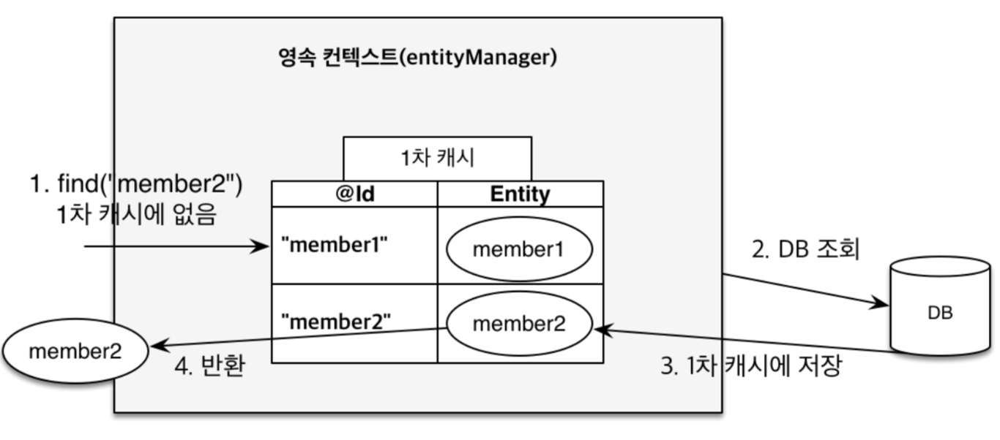

# 📍main topic : 스프링 JPA 영속성 컨텍스트란?
> ✅ 주요 키워드 : EntityManger, Entity 생명주기, 1차 캐시, 쓰기 지연, dirty checking, flush

### 영속성 컨텍스트(Pesistence Context)란?
영속성 컨텍스트는 JPA를 구성하는 핵심적인 논리 개념으로서(물론 실제 클래스로 구현된다.)
`엔티티`를 영구적으로 저장하는 환경을 말한다.

서버와 DB사이에서 존재하는 가상의 DB역할을 하며 엔티티 매니저로 저장하거나 조회하는 모든
엔티티들은 영속성 컨텍스트에의해 보관되고 관리된다.

### 엔티티 매니저란?
영속성 컨텍스트를 활용하여 우리가 원하는 CRUD작업을 처리하는 관리자 역할을 한다.
내부에 영속성 컨텍스트 구현체(hibernate -> session)를 필드로 가지며 작업을 수행한다.

기본적으로 엔티티 매니저와 영속성 컨텍스트는 `1:1` 관계를 가지나,
스프링 환경에서는 트랜잭션 AOP를 사용할때(`@Transactional`) 엔티티 매니저의 구현객체의
주입을 스프링 컨테이너가 담당하므로 `N:1`의 관계가 가능해진다.

### Entity 생명주기
#### 1. 비영속 : 영속성 컨텍스트와 관련없는 새로운 상태
  새로운 객체를 생성하고 em으로 persist하지않음 -> 영속성 컨텍스트와는 아무 관계없음.

#### 2.영속 : 영속성 컨텍스트에 의해 관리 되는상태
  새로운 객체를 생성하고 em으로 persist함 -> 영속성 컨텍스트에 의해 관리됨 (1차캐시에 존재.)
  
  혹은 `em.find`, `JPQL`을 사용해서 조회한 엔티티도 영속 상태이다.
    
#### 3. 준영속 : 영속성 컨텍스트에 저장되었다가 분리된 상태
    em.detach(객체)

#### 4. 삭제 : 삭제된 상태
    em.remove(객체)

#### 1차캐시

영속성 컨텍스트의 특징 중 하나로 관리되는 엔티티를 1차캐시에 저장한다.
이때, 1차캐시는 엔티티를 식별자와 인스턴스를 `key-value`형태로 저장한다.

> 이때 식별자는 엔티티 클래스에 지정한 `@Id`어노테이션을 가지는 필드에 의해 결정된다.

#### 왜 사용하는가?
1. 성능상 이점

   DB에 바로 접근하지 않고 메모리에 먼저 접근하므로 성능상 이점.
2. 동일성 보장
   같은 식별자로 반복조회시 1차캐시에서 식별자에 맵핑된 인스턴스를 반환하므로
   동일한 인스턴스임이 보장된다.

### 쓰기지연
엔티티 매니저는 트랜잭션을 커밋하기 직전까지 데이터베이스에 엔티티를 저장하지않고
내부 쿼리 저장소에 `INSERT SQL`을 모아둔다. 그리고 트랜잭션 커밋시점에
모아둔 쿼리를 데이터베이스에 보낸다. 이것을 쓰기지연이라한다.

매번 쿼리를 보내야하는 오버헤드가 줄어든다.

### 변경감지(dirty checking)
엔티티의 변경사항을 자동으로 감지하여 DB에 반영하는 기능을 변경감지라고한다.
엔티티가 영속성 컨텍스트에 올라갈때(영속상태가 될때) 최초 엔티티의 상태를 스냅샷으로 저장한다.
그리고 엔티티매니저 플러쉬 시점에 영속 상태인 모든 엔티티들을 스냅샷과 비교하여
변경된 필드를 찾고 있다면 `update`쿼리문을 실행한다.

> 💡 JPA에서 기본적인 update전략은 모든 필드를 업데이트하는 것이다.
> 
> 왜그럴까? 모든필드를 수정하면 엔티티의 Update쿼리문은 하나로 항상 고정된다.
> 이렇게 되면 한번 파싱된 쿼리를 재사용하는 db의 특성을 활용하여 성능상 이점을 얻을 수 있다.
> 
> 물론 필드가 지나치게 많다면 확장기능 DynamicUpdate를 사용하는것이 고려된다.

### 플러쉬
플러쉬는 영속성 컨텍스트의 변경내용을 데이터베이스에 반영한다.

